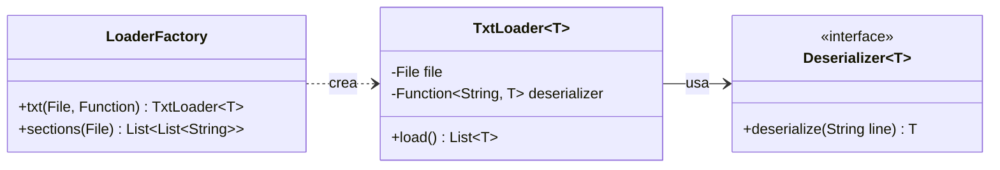

# Guía de Estudio y Justificación de Arquitectura de Software

Este documento constituye una guía técnica de nivel de arquitectura para consolidar y justificar las decisiones de diseño adoptadas a lo largo de la resolución de los problemas del proyecto. Ha sido estructurado de manera formal para proporcionar respuestas claras, fundamentadas y sólidas ante cualquier evaluación o pregunta técnica de diseño.

---

## 1. Fundamentos de Ingeniería de Software y Principios SOLID

En el desarrollo de este proyecto se han aplicado sistemáticamente los fundamentos de la ingeniería de software y los principios **SOLID**. Para responder con solvencia, se debe comprender la relación sinérgica entre ellos.

### Relación entre Fundamentos y Principios
*   **Abstracción mediante Encapsulamiento y OCP**: La abstracción es el proceso de identificar las características esenciales de un objeto y omitir los detalles irrelevantes. Esto se logra directamente a través del **Encapsulamiento** (ocultar la lógica binaria o matemática tras métodos sencillos) y el principio **Open/Closed (OCP)**, que permite extender las reglas de negocio (por ejemplo, agregar nuevas mecánicas de simulación) sin modificar el comportamiento ya encapsulado en los objetos del dominio.
*   **Composición sobre Herencia (COI) y Cohesión**: Favorecer la composición sobre la herencia nos permite construir sistemas altamente cohesivos y con **Bajo Acoplamiento**. Al delegar responsabilidades a colaboradores inyectados (por ejemplo, a través de interfaces como `Deserializer` o `MachineCommand`), evitamos la rigidez de las jerarquías de clases y mantenemos el principio de **Responsabilidad Única (SRP)** en cada componente.
*   **Interfaces para el Diseño por Contrato y DIP**: Las interfaces representan contratos puros. En lugar de que un componente dependa de una clase concreta, depende de una abstracción (cumpliendo el principio de **Inversión de Dependencias (DIP)**). Esto permite desacoplar la infraestructura (como la lectura de ficheros y el parseo de datos) del dominio matemático de los problemas.

---

## 2. Justificación Exhaustiva Día por Día

A continuación se detalla y justifica profundamente el diseño y la toma de decisiones técnicas para cada uno de los días del desafío:

### Día 01: Secret Entrance (Dial de Seguridad)
*   **El Desafío**: Simulación del movimiento circular de un dial de seguridad en base a instrucciones de rotación izquierda (`L`) o derecha (`R`). Se requiere computar las visitas a la posición `0` al final (Parte 1) y en cualquier paso intermedio (Parte 2).
*   **Técnicas y Patrones**:
    *   **Separación estricta entre Entidad y Estado**: Se modela la entidad fija `Dial` (que representa la definición física inmutable de posiciones) de manera separada de `DialStatus` (que almacena la posición actual y el historial).
    *   **Inmutabilidad**: Al procesar la secuencia mediante Java Streams, cada transición a través del método `execute(Order)` no muta el estado actual, sino que devuelve una nueva instancia de `DialStatus`. Esto elimina por completo efectos secundarios colaterales en la recursión o el filtrado de flujos.
    *   **Abstracción Matemática**: Toda la aritmética modular para gestionar los límites circulares del dial está encapsulada dentro de los métodos del Record, exponiendo al exterior una interfaz de uso puramente semántica.

### Día 02: Gift Shop (Validación de IDs en Rangos)
*   **El Desafío**: Encontrar e identificar códigos numéricos (IDs) inválidos dentro de un rango determinado. Las reglas de invalidez consisten en patrones de secuencias repetidas exactamente dos veces (Parte 1) o de forma arbitraria múltiple (Parte 2).
*   **Técnicas y Patrones**:
    *   **Polimorfismo mediante Interfaces**: Se crea la interfaz `InvalidatableId`. La clase de infraestructura `IdRange` no conoce las reglas de validación específicas de las dos partes; únicamente interactúa con la interfaz abstracta.
    *   **Desacoplamiento (DIP)**: Las implementaciones concretas `Id` para la Parte A y la Parte B encapsulan la lógica de cadenas y expresiones regulares. Esto permite añadir nuevas reglas de detección de patrones modificando únicamente las clases hoja y no el orquestador del rango.

### Día 03: Lobby (Optimización de Bancos de Baterías)
*   **El Desafío**: Seleccionar una cantidad exacta de dígitos de una batería (`BatteryBank`) para maximizar el voltaje total combinando sus valores.
*   **Técnicas y Patrones**:
    *   **Algoritmo Voraz (Greedy) con Recursión**: La estrategia óptima requiere seleccionar de forma iterativa y recursiva el dígito más alto disponible que respete la viabilidad de la cadena restante.
    *   **Separación de Modelo y Algoritmo**: La clase `BatteryBank` es un Record inmutable que representa de forma única el dominio (los dígitos crudos). La lógica matemática compleja del algoritmo de optimización se extrae a un calculador específico (`BatteryBankMaxJoltageCalculator`). Esto evita sobrecargar el Record con lógica de control algorítmico (SRP).

### Día 04: Printing Department (Accesibilidad en Cuadrícula)
*   **El Desafío**: Simular la retirada progresiva de rollos de papel en una cuadrícula bidimensional evaluando su vecindad (menos de 4 vecinos) hasta que el sistema converja.
*   **Técnicas y Patrones**:
    *   **Uso de Enums para Representación Espacial**: Se modela el enum `Direction` conteniendo los vectores de traslación espacial. Esto elimina el uso de números mágicos (`dx, dy`) en el código de cálculo bidimensional.
    *   **Patrón Entidad-Estado**: `Diagram` representa el mapa original y sus dimensiones físicas. El estado de qué elementos han sido despejados se encapsula en `DiagramStatus`, el cual produce nuevos estados inmutables `withClearedCoordinates()`.

### Día 05: Cafeteria (Fusión de Intervalos de Frescura)
*   **El Desafío**: Validar si IDs caen dentro de rangos y fusionar múltiples intervalos solapados o contiguos para calcular la cobertura total de números válidos.
*   **Técnicas y Patrones**:
    *   **Inmutabilidad Pura en Estructuras Geométricas/Numéricas**: El record `Range` implementa la lógica de intersección y fusión (`merge()`). Cada fusión devuelve un nuevo `Range` inmutable.
    *   **Programación Funcional**: El resolvedor `FreshnessValidator` ordena los intervalos y los acumula de forma declarativa empleando Streams de Java, reduciendo la complejidad ciclomática de bucles `for/while` anidados.

### Día 06: Trash Compactor (Segmentación y Transposición de Cuadrículas)
*   **El Desafío**: Resolver problemas aritméticos organizados en cuadrículas bidimensionales. En la Parte A se leen en filas (horizontal) y en la Parte B en columnas (vertical de derecha a izquierda).
*   **Técnicas y Patrones**:
    *   **Segmentación del Dominio**: La clase `Worksheet` se encarga de aislar y detectar las columnas o filas vacías que separan las operaciones matemáticas.
    *   **Transposición Matricial en Infraestructura**: Para resolver la Parte B, en lugar de duplicar el algoritmo de resolución aritmética, se aplica el principio **DRY** transponiendo la matriz de caracteres en el deserializador. El modelo y el resolvedor de operaciones `Problem` permanecen inalterados, procesando todo de forma horizontal unificada.

### Día 07: Manifold (División de Haz en Rejillas)
*   **El Desafío**: Modelar la división de haces físicos y contar el número de caminos posibles a través de una rejilla de celdas divisorias.
*   **Técnicas y Patrones**:
    *   **Reducción de Estado Fila a Fila**: Para evitar el desbordamiento de memoria por almacenar todos los caminos explícitos, se calcula la transición de caminos fila a fila usando el método `.reduce()` sobre un Record inmutable `Paths`.
    *   **Cohesión Atómica**: Se modelan objetos de grano muy fino como `Column`, `Row`, `Tile`, `Grid` y `Paths`, cada uno encapsulando reglas de transición espacial estrictas.

### Día 08: Junction Box (Conexiones en Espacio 3D - MST)
*   **El Desafío**: Encontrar la red de cableado óptima entre cajas de conexión tridimensionales minimizando la distancia euclídea al cuadrado (Árbol de Expansión Mínimo - MST).
*   **Técnicas y Patrones**:
    *   **Estructura Union-Find**: Se implementa la clase `DisjointSet` con optimizaciones de compresión de caminos y unión por tamaño para aplicar el algoritmo de Kruskal de forma eficiente.
    *   **Encapsulamiento del Estado Algorítmico**: La lógica de componentes conexos y parents se oculta por completo en `DisjointSet`. Las cajas `JunctionBox` y las conexiones `Connection` son Records inmutables limpios que interactúan de forma declarativa en `Playground`.

### Día 09: Movie Theater (Área Máxima en Planos Discretos)
*   **El Desafío**: Encontrar el rectángulo vacío de mayor área dentro de un plano discreto delimitado por coordenadas de obstáculos (baldosas de asientos de cine).
*   **Técnicas y Patrones**:
    *   **Barrido Geométrico (Sweep-line)**: El problema se modela representando el cine como una colección de segmentos y puntos geométricos.
    *   **Abstracción de Límites**: Los detalles geométricos de las intersecciones y la evaluación de colisiones con los límites del cine están encapsulados detrás del modelo, aislando los algoritmos de ordenación espacial de la lógica de entrada de datos.

### Día 10: Machine Factory (Pulsaciones de Máquina y Voltaje)
*   **El Desafío**: Determinar el coste mínimo en pulsaciones para encender componentes binarios mediante XOR (Parte A) y reducir a cero voltajes usando botones de decremento (Parte B).
*   **Técnicas y Patrones**:
    *   **Patrón Command (`MachineCommand`)**: La lógica de cálculo del coste mínimo no está acoplada directamente a la clase de datos `Machine`. Se extrae a la interfaz `MachineCommand` y se implementa en resolvedores externos (`Solver` de Parte A y `Solver` de Parte B). Esto respeta el **SRP** (la máquina no calcula su propio coste óptimo) y el **OCP** (podemos cambiar el algoritmo de resolución sin tocar el modelo de datos de la máquina).
    *   **Memoización y Optimización de Memoria**: La búsqueda recursiva en la Parte B evalúa miles de estados. Para optimizar el rendimiento, se utiliza la clase `MachineStatus` con una estructura de datos `Map` de memoización. Además, se emplean primitivos (`long` y constantes centinela `INF`) en lugar de wrappers `Optional` para evitar la sobrecarga del Recolector de Basura (Garbage Collector).

### Día 11: Reactor (Conteo de Rutas en DAG)
*   **El Desafío**: Contar todos los caminos posibles en un grafo dirigido acíclico (DAG) de dispositivos desde un origen a un destino.
*   **Técnicas y Patrones**:
    *   **Composición de Grafos**: La clase `Network` se compone de una colección de objetos `Device`.
    *   **Recursión Declarativa**: El conteo se calcula de forma recursiva utilizando Streams y programación funcional. La inmutabilidad garantiza que no haya interferencia entre las distintas ramas de búsqueda evaluadas simultáneamente.

### Día 12: Christmas Tree Farm (Validación Geométrica de Polyominoes)
*   **El Desafío**: Validar si múltiples regalos con formas complejas caben simultáneamente dentro del área de los árboles navideños.
*   **Técnicas y Patrones**:
    *   **Composición sobre Herencia (COI)**: La granja (`Farm`) se compone de múltiples regiones (`Region`), y cada región almacena una colección de formas (`Shape`).
    *   **Ley de Deméter (LoD)**: `Farm` delega el cálculo de viabilidad llamando al método `fits()` expuesto por `Region`. La granja no navega a través de las propiedades de dimensiones internas de la región o de las coordenadas individuales de las figuras.

---

## 3. Justificación de Infraestructura Común (`common.io`)

Toda la persistencia y lectura de datos se realiza a través de un framework minimalista diseñado bajo el principio de reutilización extrema (**DRY**):

### ¿Por qué se diseñó así?
1.  **LoaderFactory**: Aplica el patrón **Simple Factory** proporcionando un punto de creación unificado para lectores de texto e interpretadores de secciones. Evita que las clases `Main` tengan que conocer los detalles de construcción de `TxtLoader`.
2.  **TxtLoader**: Utiliza **Inyección de Dependencias** mediante constructores/funciones funcionales para recibir el deserializador adecuado, abstrayendo el bucle de lectura de archivos.
3.  **Deserializer<T>**: Un ejemplo perfecto del **Principio de Segregación de Interfaces (ISP)**. Contiene un único método conceptual que define el contrato formal de entrada para cualquier dominio del proyecto.

---

## 4. ¿Por qué NO se utiliza MVC o MVP?

Una de las preguntas más críticas en el diseño arquitectónico es la elección de patrones de presentación. En este proyecto se ha omitido deliberadamente la implementación de **Model-View-Controller (MVC)** o **Model-View-Presenter (MVP)**. La justificación técnica es la siguiente:

### 1. Ausencia de Capa de Presentación o UI Compleja
*   **MVC** y **MVP** son patrones diseñados específicamente para desacoplar la lógica de presentación (interfaz de usuario) del modelo de datos y las reglas de negocio. Su objetivo es gestionar la interacción del usuario en pantallas (clics, entradas de formulario, actualizaciones de UI).
*   Este proyecto consiste en un conjunto de motores de cálculo algorítmico y matemático (Advent of Code). La salida del programa es puramente por consola o flujos de texto (`System.out.println`).
*   Introducir un controlador o presentador añadiría una capa de indirección artificial (código redundante o *boilerplate*), lo que violaría el principio **YAGNI (You Aren't Gonna Need It)** y aumentaría innecesariamente la complejidad cognitiva del sistema.

### 2. Violación de Principios de Simplicidad
*   En sistemas de procesamiento por lotes o CLI puras, el patrón adecuado es el flujo de tubería (**Pipeline**) o **Input-Process-Output (IPO)**:
    1.  **Input**: Gestionado por `LoaderFactory` / `TxtLoader`.
    2.  **Process**: Gestionado por el resolvedor (`Solver` / `Factory`).
    3.  **Output**: Consola/Salida estándar (`Main`).
*   Separar esto en vistas y controladores dispersaría la lógica lineal del flujo de cálculo, dificultando el mantenimiento y el seguimiento del flujo de control en la depuración.

### 3. Diferencia entre "Domain Model" y "MVC Model"
*   En este proyecto, el "Model" es un modelo de dominio rico (Records cohesivos con comportamiento puro). En MVC, el modelo a menudo termina degradándose en meras estructuras de datos (Anemic Domain Model) para que el controlador funcione como intermediario, lo cual va en contra de la abstracción de alta cohesión que hemos implementado.

---

## 5. Preguntas Clave y Respuestas de Arquitecto

Si se te pregunta sobre decisiones de diseño específicas durante una evaluación, utiliza estas respuestas clave:

*   **Pregunta: ¿Por qué usaste Interfaces en lugar de Clases Abstractas para los Solvers o Deserializadores?**
    *   *Respuesta*: "Porque las interfaces definen contratos de comportamiento puro sin imponer una jerarquía de herencia. Esto nos da la flexibilidad de implementar múltiples contratos si fuera necesario, promueve el desacoplamiento total y facilita la creación de dobles de prueba (Mocks/Stubs) para las pruebas unitarias. La herencia abstracta habría acoplado las implementaciones a una jerarquía rígida".
*   **Pregunta: ¿Cómo se ve el principio de Responsabilidad Única (SRP) en tu código?**
    *   *Respuesta*: "El SRP se observa claramente al separar el parsing, el dominio y el cálculo. Por ejemplo, en el Día 10, la clase `Machine` solo representa la estructura de la máquina, `TxtMachineDeserializer` es el único responsable de parsear los datos de entrada, y el `Solver` (a través de `MachineCommand`) encapsula exclusivamente la lógica algorítmica de resolución. Ninguno de estos componentes tiene más de una razón para cambiar".
*   **Pregunta: ¿Por qué elegiste Records en lugar de Clases convencionales?**
    *   *Respuesta*: "Los Java Records nos garantizan inmutabilidad por defecto (todos los campos son `final`). Esto previene efectos colaterales indeseados y problemas de concurrencia, además de proporcionarnos automáticamente métodos como `equals()`, `hashCode()` y `toString()`, lo cual reduce el código repetitivo y mejora la expresividad y legibilidad del modelo de dominio".
*   **Pregunta: ¿Cómo se relacionan y complementan la Cohesión y el Acoplamiento en este proyecto?**
    *   *Respuesta*: "Buscamos siempre alta cohesión (que una clase haga una sola cosa y la haga muy bien) y bajo acoplamiento (que los módulos dependan lo mínimo posible entre sí). En nuestro diseño, esto se logra aislando responsabilidades: por ejemplo, `TxtLoader` no sabe cómo procesar datos ni de qué dominio se trata; solo sabe abrir archivos y mapear líneas mediante `Deserializer<T>`. Esta separación mantiene los módulos independientes y altamente enfocados".
*   **Pregunta: ¿Qué beneficio aporta la inmutabilidad de los Records de Java al diseño de tus algoritmos?**
    *   *Respuesta*: "La inmutabilidad elimina por completo los efectos secundarios no controlados (side-effects). Al trabajar con algoritmos recursivos, programación dinámica o backtracking (como en el Día 10), es vital que al evaluar un estado este no se corrompa para otras bifurcaciones de la recursión. La inmutabilidad garantiza que cada estado (`MachineStatus`) sea un valor puro y predecible, facilitando además la memoización en colecciones Map sin temor a que las claves muten y rompan su `hashCode()`".
*   **Pregunta: En el Día 10, ¿por qué desacoplaste la lógica de resolución de la clase `Machine` usando `MachineCommand` en lugar de poner un método `solve()` en ella?**
    *   *Respuesta*: "Para cumplir con el principio de Abierto/Cerrado (OCP) y Segregación de Responsabilidades. Si pusiéramos el método `solve()` dentro de `Machine`, la clase tendría que conocer la lógica compleja del algoritmo de resolución (backtracking, programación dinámica, etc.). Al usar la interfaz parametrizada `MachineCommand<T>`, permitimos que la entidad de dominio sea puramente un objeto de datos (Record) y dejamos la computación a resolvedores especializados. Si el día de mañana queremos añadir un tercer algoritmo alternativo, solo creamos un nuevo `Solver` sin alterar ni una sola línea de la clase `Machine`".
*   **Pregunta: ¿Por qué se prefiere Composición sobre Herencia (COI) en la relación de `Factory` y `Machine`?**
    *   *Respuesta*: "Si `Factory` heredara de una hipotética clase base `MachineCollection`, estaríamos creando un acoplamiento rígido de subtipado ('es-un'). Al usar composición ('tiene-un'), `Factory` encapsula una `List<T extends Machine>` como un atributo. Esto nos permite cambiar o configurar de forma dinámica la colección de máquinas, estructurar de manera independiente sus operaciones y evitar la propagación de métodos no deseados de la clase base a la clase derivada".
*   **Pregunta: ¿Qué patrón de diseño se utiliza en la infraestructura de entrada (`LoaderFactory`) y qué problema resuelve?**
    *   *Respuesta*: "Utiliza el patrón **Simple Factory**. Resuelve el problema de la instanciación directa y repetitiva. En lugar de que cada `Main` instancie directamente un `TxtLoader` configurando sus parámetros (fichero, deserializador, cabecera), el cliente delega esa creación en `LoaderFactory.txt(...)`. Esto encapsula las reglas de construcción de los lectores de datos en un único punto centralizado".
