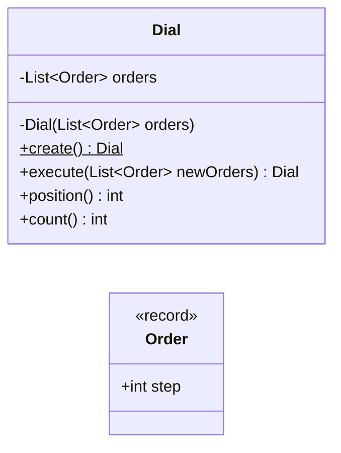

# Day 01 (Parte A)

```mermaid
%%{init: { 'themeVariables': { 'lineColor': '#FFFFFF' } } }%%
classDiagram
    direction TB
    class Dial {
        -List~Order~ orders
        -Dial(List~Order~ orders)
        +create()$ Dial
        +execute(List~Order~ newOrders) Dial
        +position() int
        +count() int
    }

    class Order {
        <<record>>
        +int step
    }

    Dial  --> Order
```
