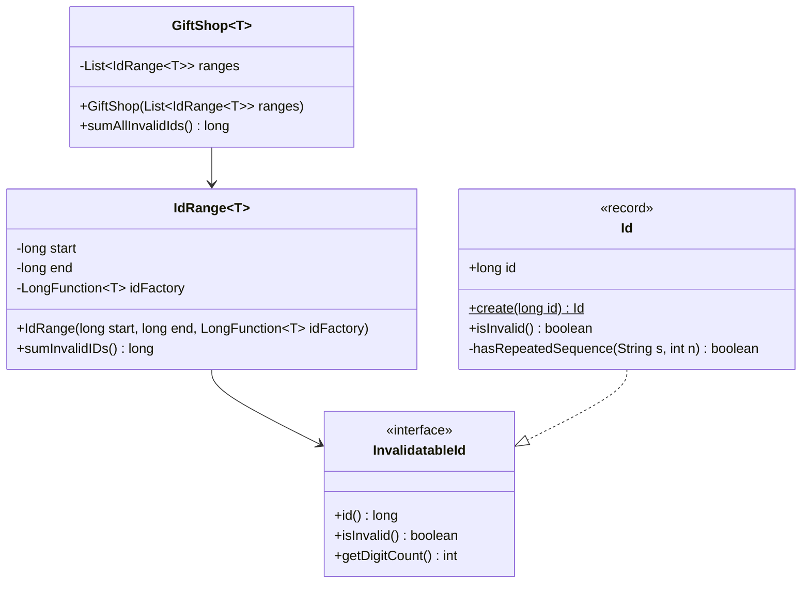

# Day 02 (Parte B)

```mermaid
classDiagram
    direction TB
    class GiftShop~T~ {
        -List~IdRange~T~~ ranges
        +GiftShop(List~IdRange~T~~ ranges)
        +sumAllInvalidIds() long
    }
    class IdRange~T~ {
        -long start
        -long end
        -LongFunction~T~ idFactory
        +IdRange(long start, long end, LongFunction~T~ idFactory)
        +sumInvalidIDs() long
    }
    class InvalidatableId {
        <<interface>>
        +id() long
        +isInvalid() boolean
        +getDigitCount() int
    }
    class Id {
        <<record>>
        +long id
        +create(long id)$ Id
        +isInvalid() boolean
        -hasRepeatedSequence(String s, int n) boolean
    }
    GiftShop --> IdRange
    IdRange --> InvalidatableId
    Id ..|> InvalidatableId
```
