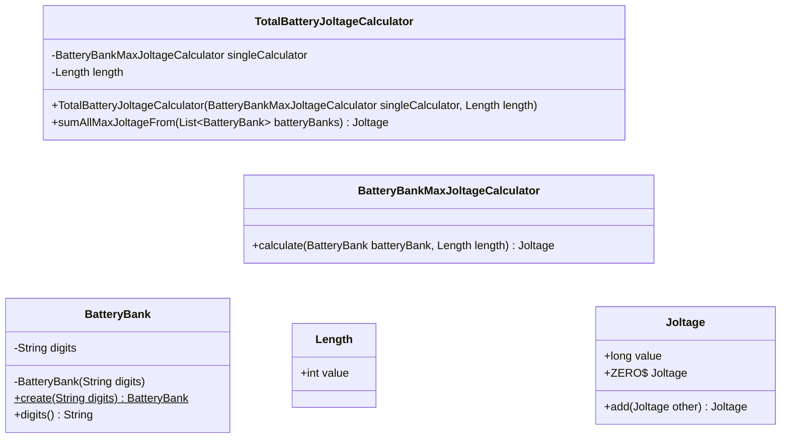

# Day 03

```mermaid
%%{init: { 'themeVariables': { 'lineColor': '#FFFFFF' } } }%%
classDiagram
    direction TB
    class TotalBatteryJoltageCalculator {
        -BatteryBankMaxJoltageCalculator singleCalculator
        -Length length
        +TotalBatteryJoltageCalculator(BatteryBankMaxJoltageCalculator singleCalculator, Length length)
        +sumAllMaxJoltageFrom(List~BatteryBank~ batteryBanks) Joltage
    }
    class BatteryBankMaxJoltageCalculator {
        +calculate(BatteryBank batteryBank, Length length) Joltage
    }
    class BatteryBank {
        -String digits
        -BatteryBank(String digits)
        +create(String digits)$ BatteryBank
        +digits() String
    }
    class Joltage {
        +long value
        +ZERO$ Joltage
        +add(Joltage other) Joltage
    }
    class Length {
        +int value
    }
    TotalBatteryJoltageCalculator --> BatteryBankMaxJoltageCalculator
    TotalBatteryJoltageCalculator --> Length
    TotalBatteryJoltageCalculator ..> BatteryBank
    TotalBatteryJoltageCalculator ..> Joltage
    BatteryBankMaxJoltageCalculator ..> BatteryBank
    BatteryBankMaxJoltageCalculator ..> Length
    BatteryBankMaxJoltageCalculator ..> Joltage
```
