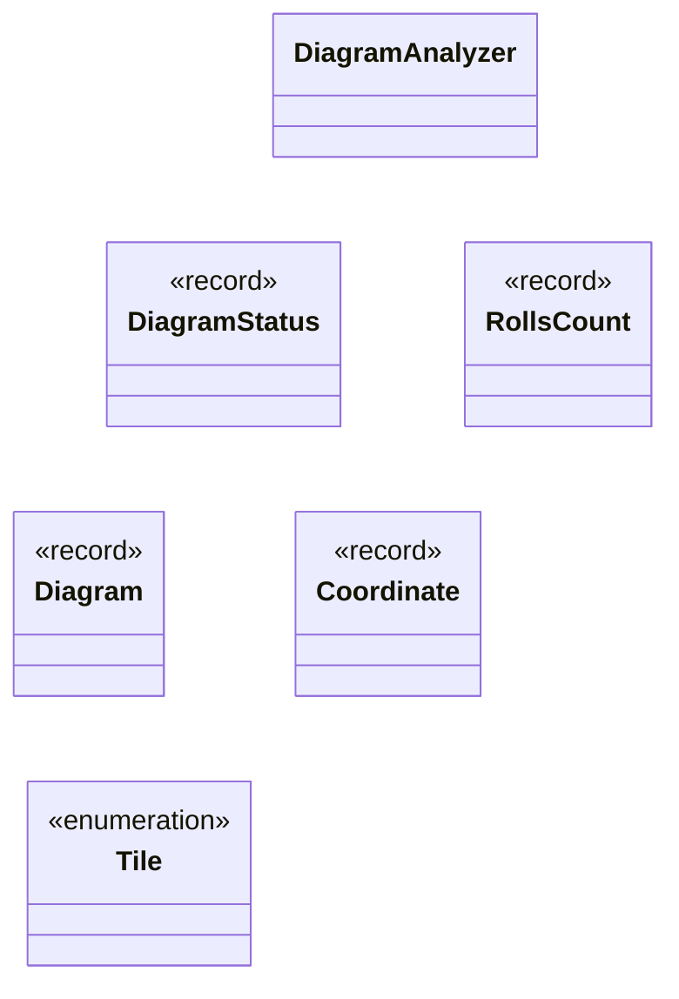

# Day 04

```mermaid
%%{init: { 'themeVariables': { 'lineColor': '#FFFFFF' } } }%%
classDiagram
    direction TB
    class DiagramAnalyzer {
    }
    class Diagram {
        <<record>>
    }
    class DiagramStatus {
        <<record>>
    }
    class Coordinate {
        <<record>>
    }
    class Tile {
        <<enumeration>>
    }
    class RollsCount {
        <<record>>
    }
    DiagramAnalyzer --> DiagramStatus
    DiagramAnalyzer --> Coordinate
    DiagramAnalyzer --> RollsCount
    DiagramStatus --> Diagram
    DiagramStatus --> Tile
    DiagramStatus --> Coordinate
    Diagram --> Tile
```
