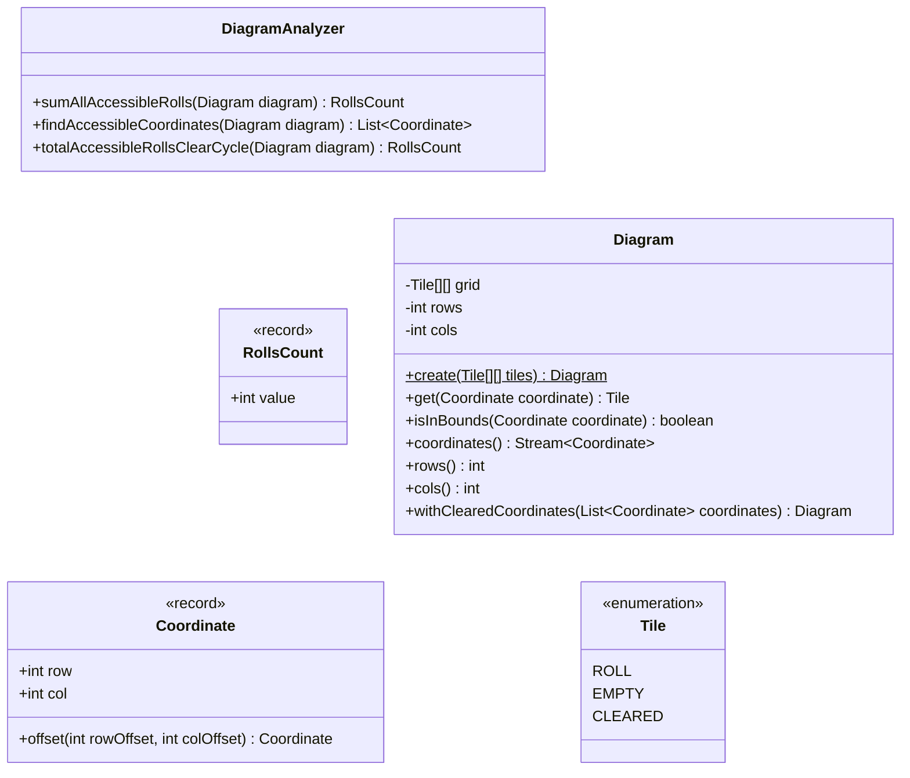

# Day 04 (Parte B)

```mermaid
%%{init: { 'themeVariables': { 'lineColor': '#FFFFFF' } } }%%
classDiagram
    direction TB
    class DiagramAnalyzer {
        +sumAllAccessibleRolls(Diagram diagram) RollsCount
        +findAccessibleCoordinates(Diagram diagram) List~Coordinate~
        +totalAccessibleRollsClearCycle(Diagram diagram) RollsCount
    }
    class Diagram {
        -Tile[][] grid
        -int rows
        -int cols
        +create(Tile[][] tiles)$ Diagram
        +get(Coordinate coordinate) Tile
        +isInBounds(Coordinate coordinate) boolean
        +coordinates() Stream~Coordinate~
        +rows() int
        +cols() int
        +withClearedCoordinates(List~Coordinate~ coordinates) Diagram
    }
    class Coordinate {
        <<record>>
        +int row
        +int col
        +offset(int rowOffset, int colOffset) Coordinate
    }
    class Tile {
        <<enumeration>>
        ROLL
        EMPTY
        CLEARED
    }
    class RollsCount {
        <<record>>
        +int value
    }
    DiagramAnalyzer --> Diagram
    DiagramAnalyzer --> Coordinate
    DiagramAnalyzer --> RollsCount
    Diagram --> Coordinate
    Diagram --> Tile
```
