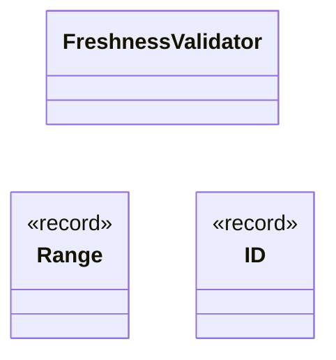

# Day 05

```mermaid
%%{init: { 'themeVariables': { 'lineColor': '#FFFFFF' } } }%%
classDiagram
    direction TB
    class FreshnessValidator {
    }
    class Range {
        <<record>>
    }
    class ID {
        <<record>>
    }
    FreshnessValidator --> Range
    FreshnessValidator --> ID
```
