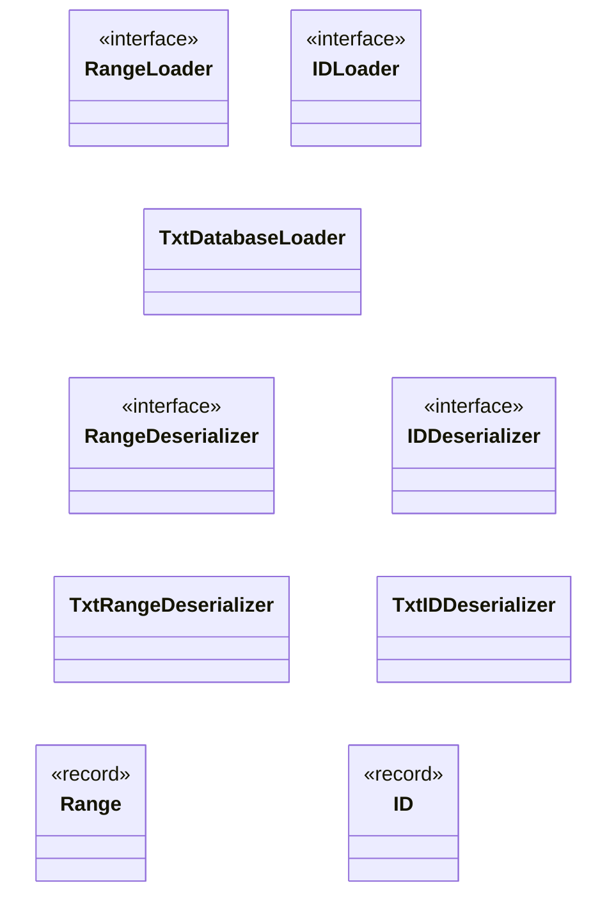

# Day 05 - I/O
 

```mermaid
%%{init: { 'themeVariables': { 'lineColor': '#FFFFFF' } } }%%
classDiagram
    direction TB
    class RangeLoader {
        <<interface>>
    }
    class IDLoader {
        <<interface>>
    }
    class RangeDeserializer {
        <<interface>>
    }
    class IDDeserializer {
        <<interface>>
    }
    class TxtDatabaseLoader {
    }
    class TxtRangeDeserializer {
    }
    class TxtIDDeserializer {
    }
    class Range {
        <<record>>
    }
    class ID {
        <<record>>
    }
 
    RangeLoader <|.. TxtDatabaseLoader 
    IDLoader <|.. TxtDatabaseLoader 
    RangeDeserializer <|.. TxtRangeDeserializer 
    IDDeserializer <|.. TxtIDDeserializer 
 
    TxtDatabaseLoader --> RangeDeserializer 
    TxtDatabaseLoader --> IDDeserializer 
    TxtDatabaseLoader ..> Range 
    TxtDatabaseLoader ..> ID 
 
    TxtRangeDeserializer ..> Range 
    TxtRangeDeserializer ..> ID 
    TxtIDDeserializer ..> ID 
```
