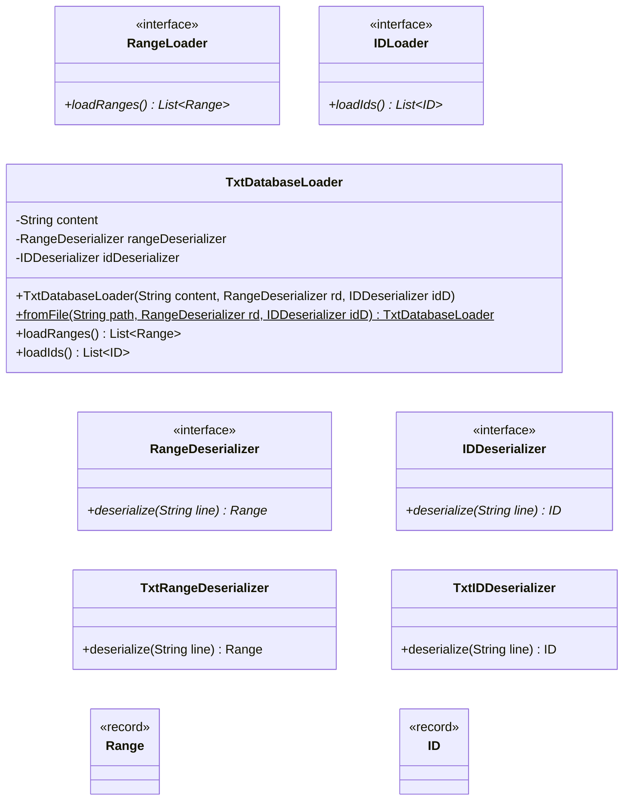

# Day 05 - I/O
 

```mermaid
%%{init: { 'themeVariables': { 'lineColor': '#FFFFFF' } } }%%
classDiagram
    direction TB
    class RangeLoader {
        <<interface>>
        +loadRanges()* List~Range~
    }
    class IDLoader {
        <<interface>>
        +loadIds()* List~ID~
    }
    class RangeDeserializer {
        <<interface>>
        +deserialize(String line)* Range
    }
    class IDDeserializer {
        <<interface>>
        +deserialize(String line)* ID
    }
    class TxtDatabaseLoader {
        -String content
        -RangeDeserializer rangeDeserializer
        -IDDeserializer idDeserializer
        +TxtDatabaseLoader(String content, RangeDeserializer rd, IDDeserializer idD)
        +fromFile(String path, RangeDeserializer rd, IDDeserializer idD)$ TxtDatabaseLoader
        +loadRanges() List~Range~
        +loadIds() List~ID~
    }
    class TxtRangeDeserializer {
        +deserialize(String line) Range
    }
    class TxtIDDeserializer {
        +deserialize(String line) ID
    }
    class Range {
        <<record>>
    }
    class ID {
        <<record>>
    }
 
    %% Implementaciones de interfaces
    RangeLoader <|.. TxtDatabaseLoader 
    IDLoader <|.. TxtDatabaseLoader 
    RangeDeserializer <|.. TxtRangeDeserializer 
    IDDeserializer <|.. TxtIDDeserializer 
 
    %% Dependencias del cargador
    TxtDatabaseLoader --> RangeDeserializer 
    TxtDatabaseLoader --> IDDeserializer 
    TxtDatabaseLoader ..> Range 
    TxtDatabaseLoader ..> ID 
 
    %% Dependencias de deserializadores
    TxtRangeDeserializer ..> Range 
    TxtRangeDeserializer ..> ID 
    TxtIDDeserializer ..> ID 
```
