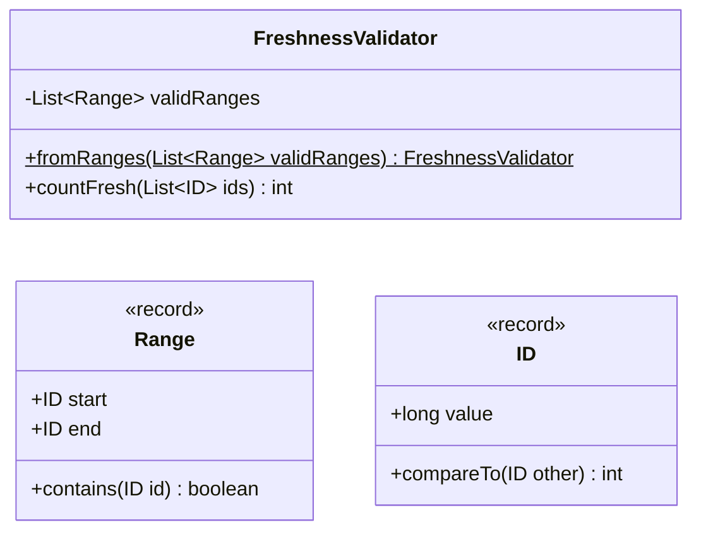

# Day 05 (Parte A)

```mermaid
%%{init: { 'themeVariables': { 'lineColor': '#FFFFFF' } } }%%
classDiagram
    direction TB
    class FreshnessValidator {
        -List~Range~ validRanges
        +fromRanges(List~Range~ validRanges)$ FreshnessValidator
        +countFresh(List~ID~ ids) int
    }
    class Range {
        <<record>>
        +ID start
        +ID end
        +contains(ID id) boolean
    }
    class ID {
        <<record>>
        +long value
        +compareTo(ID other) int
    }
    FreshnessValidator --> Range
    FreshnessValidator --> ID
```
