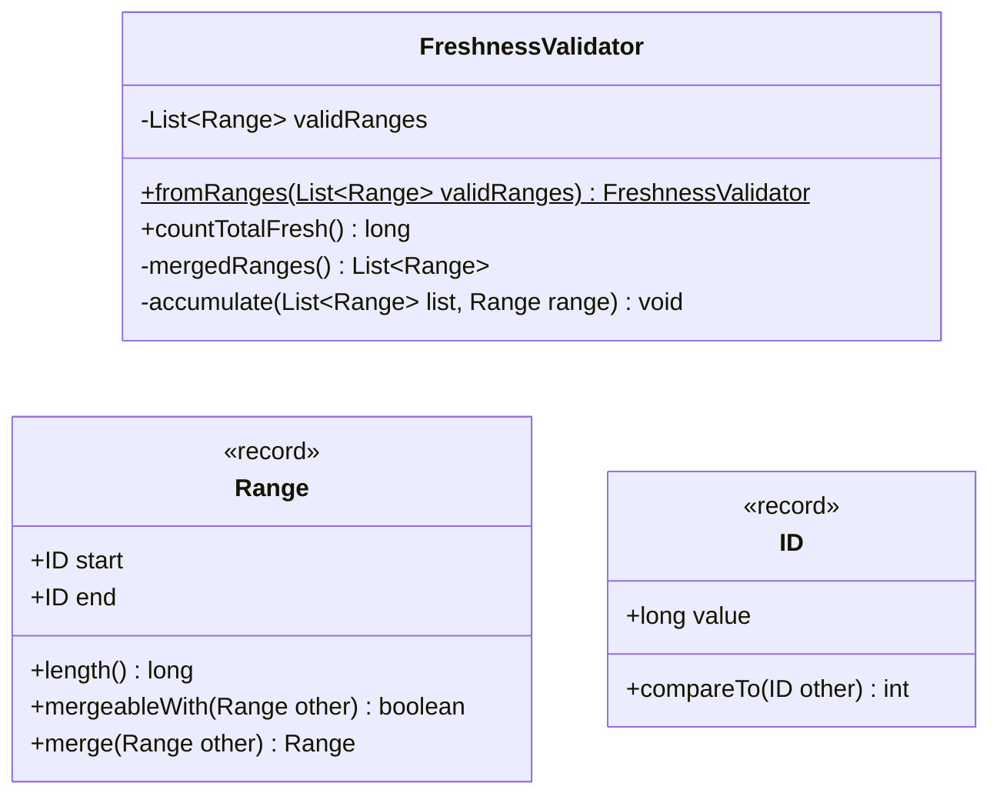

# Day 05 (Parte B)

```mermaid
%%{init: { 'themeVariables': { 'lineColor': '#FFFFFF' } } }%%
classDiagram
    direction TB
    class FreshnessValidator {
        -List~Range~ validRanges
        +fromRanges(List~Range~ validRanges)$ FreshnessValidator
        +countTotalFresh() long
        -mergedRanges() List~Range~
        -accumulate(List~Range~ list, Range range) void
    }
    class Range {
        <<record>>
        +ID start
        +ID end
        +length() long
        +mergeableWith(Range other) boolean
        +merge(Range other) Range
    }
    class ID {
        <<record>>
        +long value
        +compareTo(ID other) int
    }

    FreshnessValidator --> Range
    FreshnessValidator --> ID
```
