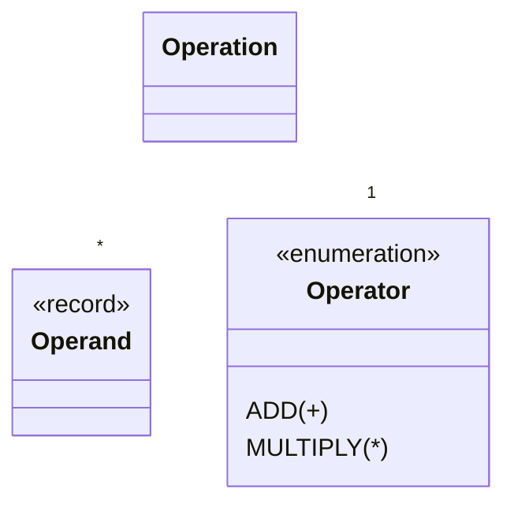

# Day 06 - Modelo

```mermaid
%%{init: { 'themeVariables': { 'lineColor': '#FFFFFF' } } }%%
classDiagram
    direction TB

    class Operation {
    }

    class Operand {
        <<record>>
    }

    class Operator {
        <<enumeration>>
        ADD(+)
        MULTIPLY(*)
    }

    Operation --> "*" Operand
    Operation --> "1" Operator
```
