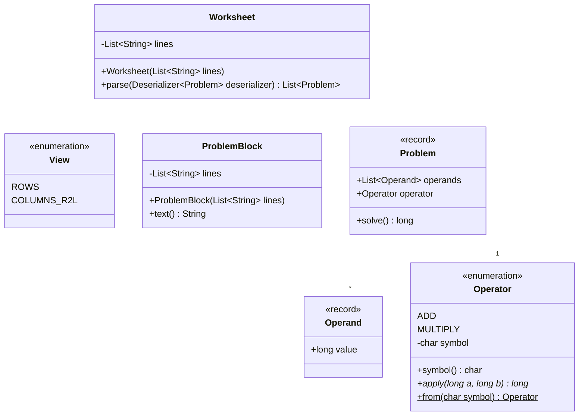

# Day 06 - Modelo

```mermaid
%%{init: { 'themeVariables': { 'lineColor': '#FFFFFF' } } }%%
classDiagram
    direction TB
    class Worksheet {
        -List~String~ lines
        +Worksheet(List~String~ lines)
        +parse(Deserializer~Problem~ deserializer) List~Problem~
    }
    class View {
        <<enumeration>>
        ROWS
        COLUMNS_R2L
    }
    class ProblemBlock {
        -List~String~ lines
        +ProblemBlock(List~String~ lines)
        +text() String
    }
    class Problem {
        <<record>>
        +List~Operand~ operands
        +Operator operator
        +solve() long
    }
    class Operand {
        <<record>>
        +long value
    }
    class Operator {
        <<enumeration>>
        ADD
        MULTIPLY
        -char symbol
        +symbol() char
        +apply(long a, long b)* long
        +from(char symbol)$ Operator
    }

    Worksheet *-- View
    Worksheet ..> ProblemBlock 
    Worksheet ..> Problem
    Problem --> "*" Operand
    Problem --> "1" Operator
```
