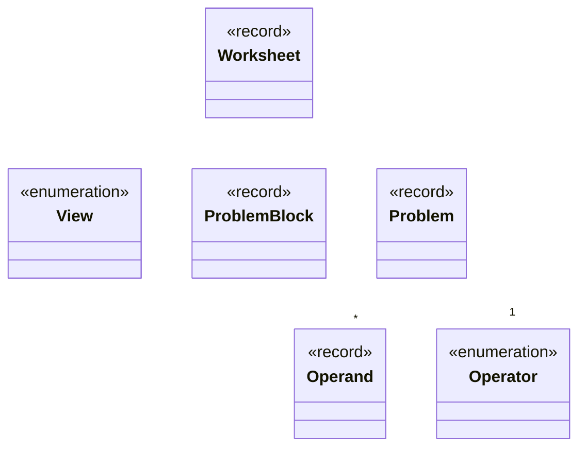

# Day 06 - Modelo

```mermaid
%%{init: { 'themeVariables': { 'lineColor': '#FFFFFF' } } }%%
classDiagram
    direction TB
    class Worksheet {
        <<record>>
    }
    class View {
        <<enumeration>>
    }
    class ProblemBlock {
        <<record>>
    }
    class Problem {
        <<record>>
    }
    class Operand {
        <<record>>
    }
    class Operator {
        <<enumeration>>
    }

    Worksheet *-- View
    Worksheet ..> ProblemBlock 
    Worksheet ..> Problem
    Problem --> "*" Operand
    Problem --> "1" Operator
```
