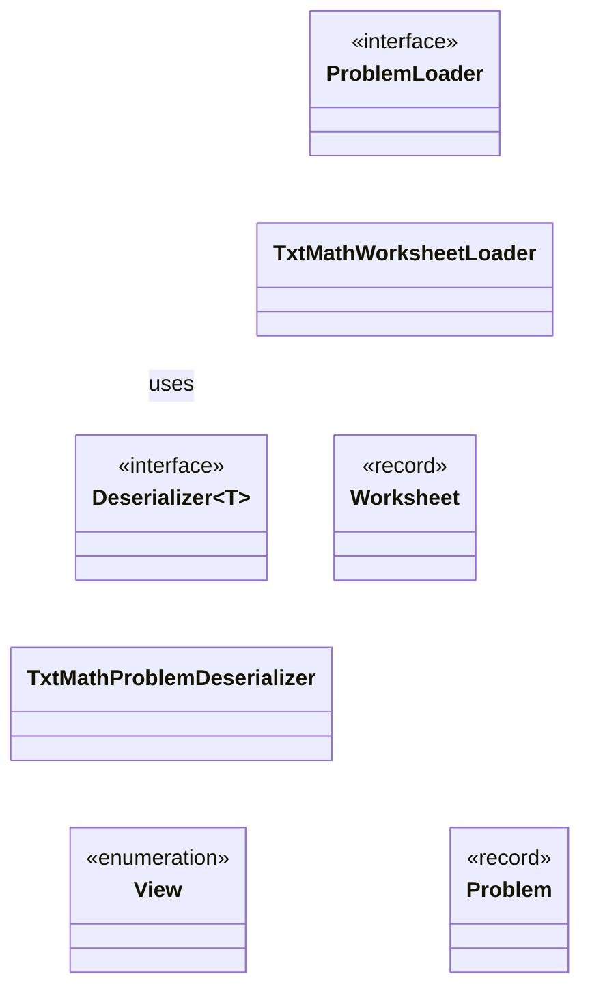

# Day 06 - I/O

```mermaid
%%{init: { 'themeVariables': { 'lineColor': '#FFFFFF' } } }%%
classDiagram
    direction TB
    class Deserializer~T~ {
        <<interface>>
    }
    class ProblemLoader {
        <<interface>>
    }
    class TxtMathWorksheetLoader {
    }
    class TxtMathProblemDeserializer {
    }
    class Worksheet {
        <<record>>
    }
    class View {
        <<enumeration>>
    }
    class Problem {
        <<record>>
    }

    ProblemLoader <|.. TxtMathWorksheetLoader
    Deserializer <|.. TxtMathProblemDeserializer
    TxtMathWorksheetLoader --> Deserializer : uses
    TxtMathWorksheetLoader ..> Worksheet
    TxtMathWorksheetLoader ..> Problem
    TxtMathProblemDeserializer --> View
    TxtMathProblemDeserializer ..> Problem
```
