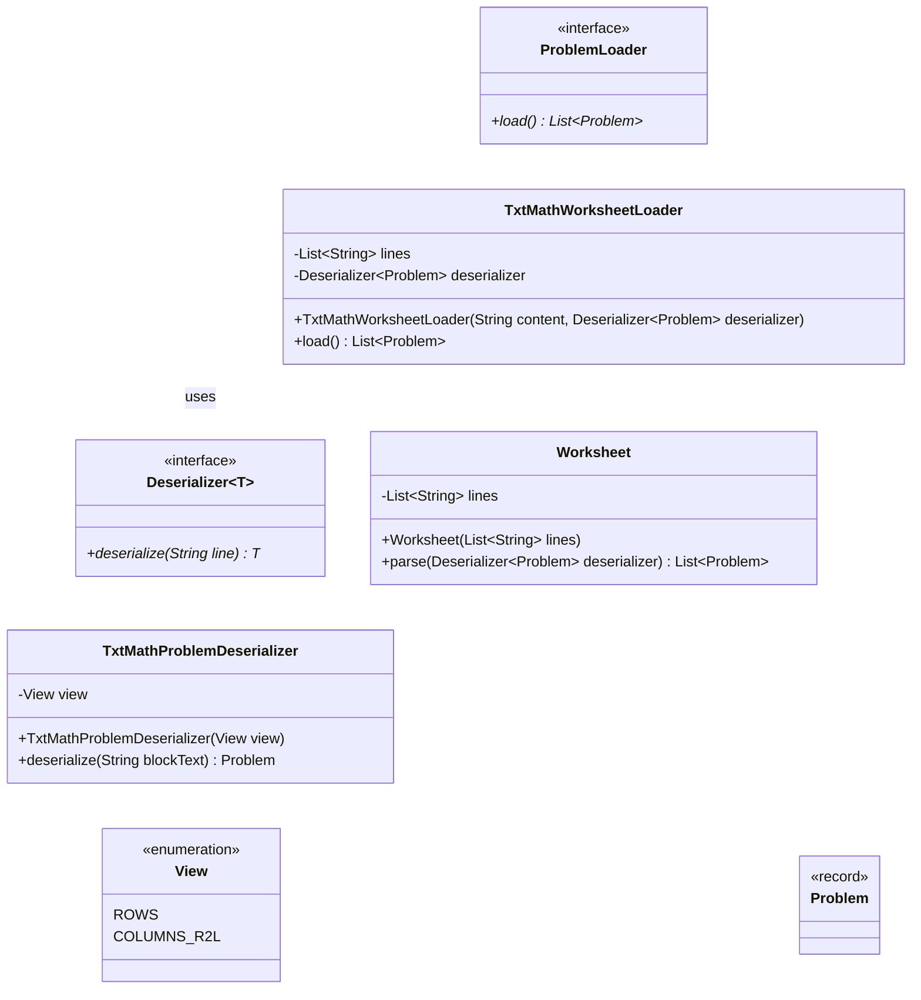

# Day 06 - I/O

```mermaid
%%{init: { 'themeVariables': { 'lineColor': '#FFFFFF' } } }%%
classDiagram
    direction TB
    class Deserializer~T~ {
        <<interface>>
        +deserialize(String line)* T
    }
    class ProblemLoader {
        <<interface>>
        +load()* List~Problem~
    }
    class TxtMathWorksheetLoader {
        -List~String~ lines
        -Deserializer~Problem~ deserializer
        +TxtMathWorksheetLoader(String content, Deserializer~Problem~ deserializer)
        +load() List~Problem~
    }
    class TxtMathProblemDeserializer {
        -View view
        +TxtMathProblemDeserializer(View view)
        +deserialize(String blockText) Problem

    }
    class Worksheet {
        -List~String~ lines
        +Worksheet(List~String~ lines)
        +parse(Deserializer~Problem~ deserializer) List~Problem~
    }
    class View {
        <<enumeration>>
        ROWS
        COLUMNS_R2L
    }
    class Problem {
        <<record>>
    }

    ProblemLoader <|.. TxtMathWorksheetLoader
    Deserializer <|.. TxtMathProblemDeserializer
    TxtMathWorksheetLoader --> Deserializer : uses
    TxtMathWorksheetLoader ..> Worksheet
    TxtMathWorksheetLoader ..> Problem
    TxtMathProblemDeserializer --> View
    TxtMathProblemDeserializer ..> Problem
```
