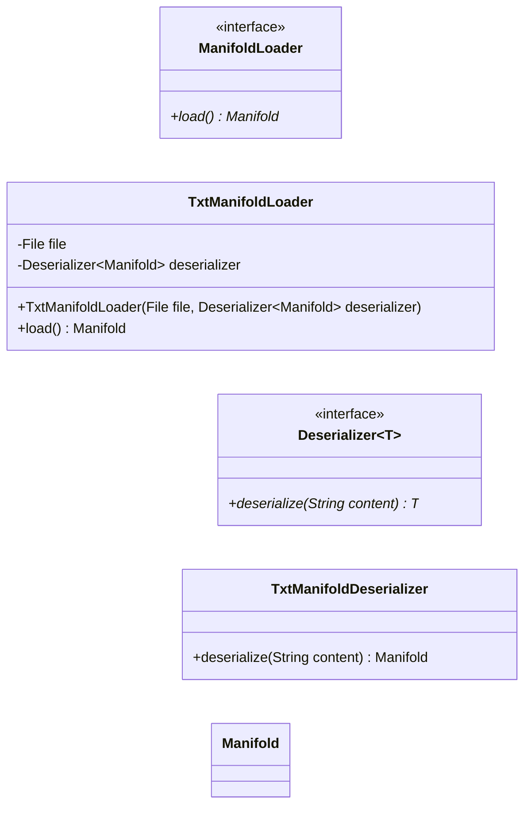

# Day 07 - I/O
 

```mermaid
%%{init: { 'themeVariables': { 'lineColor': '#FFFFFF' } } }%%
classDiagram
    direction TB
    class ManifoldLoader {
        <<interface>>
        +load()* Manifold
    }
    class Deserializer~T~ {
        <<interface>>
        +deserialize(String content)* T
    }
    class TxtManifoldLoader {
        -File file
        -Deserializer~Manifold~ deserializer
        +TxtManifoldLoader(File file, Deserializer~Manifold~ deserializer)
        +load() Manifold
    }
    class TxtManifoldDeserializer {
        +deserialize(String content) Manifold
    }
    class Manifold {
    }
 
    %% Implementaciones de interfaces
    ManifoldLoader <|.. TxtManifoldLoader
    Deserializer <|.. TxtManifoldDeserializer
 
    %% Dependencias del cargador y deserializador
    TxtManifoldLoader --> Deserializer~Manifold~
    TxtManifoldLoader ..> Manifold
    TxtManifoldDeserializer ..> Manifold
```
