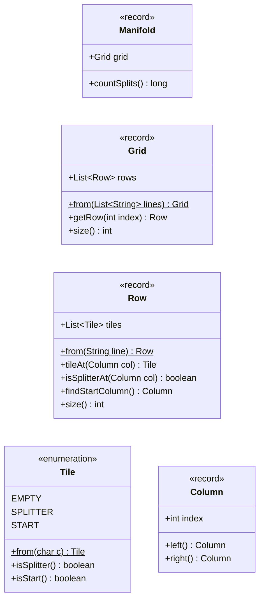

# Day 07 (Parte A)

```mermaid
%%{init: { 'themeVariables': { 'lineColor': '#FFFFFF' } } }%%
classDiagram
    direction TB
    class Manifold {
        <<record>>
        +Grid grid
        +countSplits() long
    }
    class Grid {
        <<record>>
        +List~Row~ rows
        +from(List~String~ lines)$ Grid
        +getRow(int index) Row
        +size() int
    }
    class Row {
        <<record>>
        +List~Tile~ tiles
        +from(String line)$ Row
        +tileAt(Column col) Tile
        +isSplitterAt(Column col) boolean
        +findStartColumn() Column
        +size() int
    }
    class Tile {
        <<enumeration>>
        EMPTY
        SPLITTER
        START
        +from(char c)$ Tile
        +isSplitter() boolean
        +isStart() boolean
    }
    class Column {
        <<record>>
        +int index
        +left() Column
        +right() Column
    }
    Manifold --> Grid
    Grid --> Row
    Row --> Tile
    Row --> Column
```
