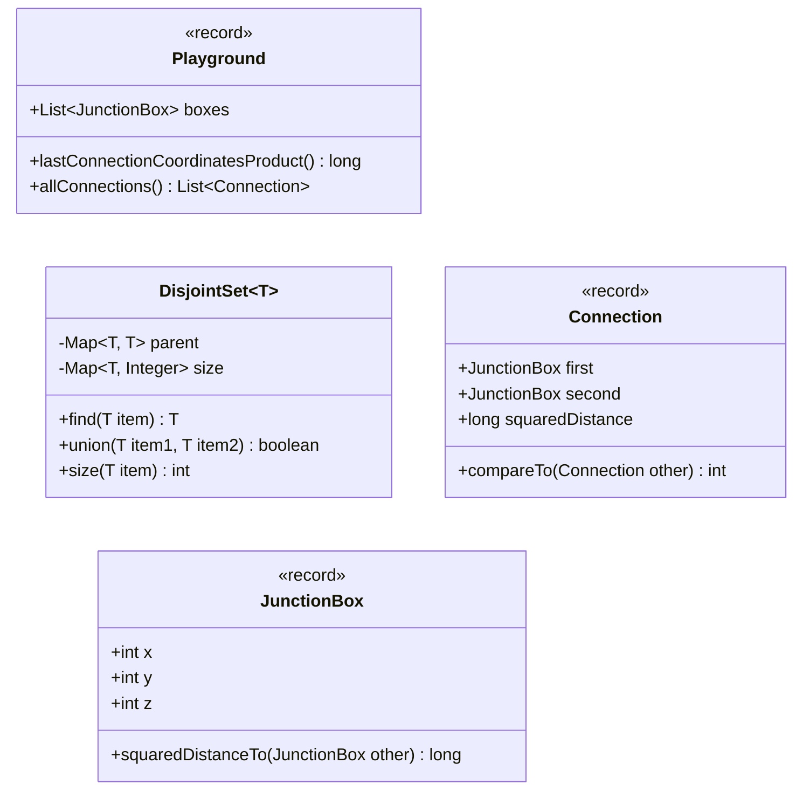

# Day 08 (Parte B)

```mermaid
%%{init: { 'themeVariables': { 'lineColor': '#FFFFFF' } } }%%
classDiagram
    direction TB
    class Playground {
        <<record>>
        +List~JunctionBox~ boxes
        +lastConnectionCoordinatesProduct() long
        +allConnections() List~Connection~
    }
    class Connection {
        <<record>>
        +JunctionBox first
        +JunctionBox second
        +long squaredDistance
        +compareTo(Connection other) int
    }
    class JunctionBox {
        <<record>>
        +int x
        +int y
        +int z
        +squaredDistanceTo(JunctionBox other) long
    }
    class DisjointSet~T~ {
        -Map~T, T~ parent
        -Map~T, Integer~ size
        +find(T item) T
        +union(T item1, T item2) boolean
        +size(T item) int
    }
    Playground --> JunctionBox
    Playground --> Connection
    Playground --> DisjointSet
    Connection --> JunctionBox
```
