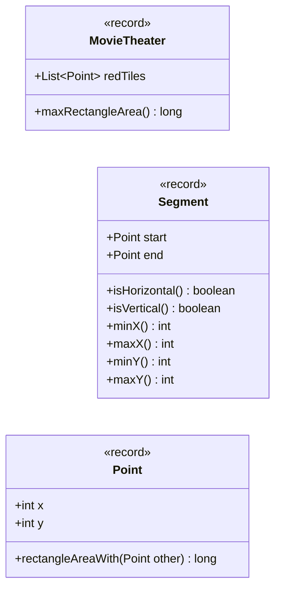

# Day 09 (Parte B)

```mermaid
%%{init: { 'themeVariables': { 'lineColor': '#FFFFFF' } } }%%
classDiagram
    direction TB
    class MovieTheater {
        <<record>>
        +List~Point~ redTiles
        +maxRectangleArea() long
    }
    class Segment {
        <<record>>
        +Point start
        +Point end
        +isHorizontal() boolean
        +isVertical() boolean
        +minX() int
        +maxX() int
        +minY() int
        +maxY() int
    }
    class Point {
        <<record>>
        +int x
        +int y
        +rectangleAreaWith(Point other) long
    }
    MovieTheater --> Point
    MovieTheater --> Segment
    Segment --> Point
```
