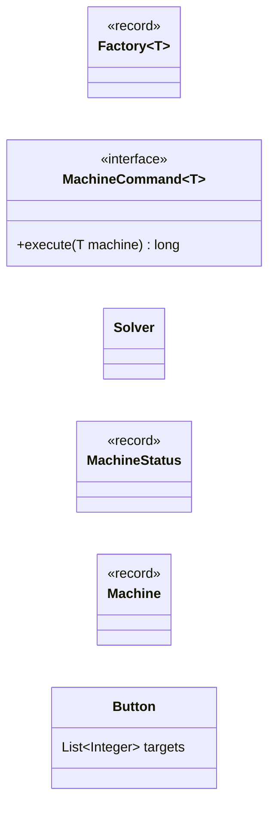

# Day 10 (Parte B)

```mermaid
%%{init: { 'themeVariables': { 'lineColor': '#FFFFFF' } } }%%
classDiagram
    direction TB

    class Factory~T~ {
        <<record>>
    }

    class MachineCommand~T~ {
        <<interface>>
        +execute(T machine) long
    }

    class Machine {
        <<record>>
    }

    class Button {
        List~Integer~ targets
    }

    class Solver {
    }

    class MachineStatus {
        <<record>>
    }

    Factory --> MachineCommand
    MachineCommand <|.. Solver
    Solver ..> MachineStatus
    MachineStatus --> Machine
    Machine --> Button
```