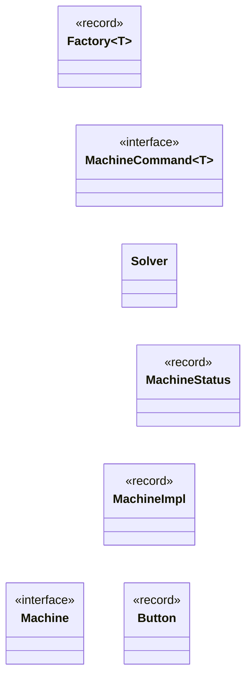

# Day 10 (Parte B)

```mermaid
%%{init: { 'themeVariables': { 'lineColor': '#FFFFFF' } } }%%
classDiagram
    direction TB
    class Factory~T~ {
        <<record>>
    }
    class Machine {
        <<interface>>
    }
    class MachineCommand~T~ {
        <<interface>>
    }
    class MachineImpl {
        <<record>>
    }
    class Button {
        <<record>>
    }
    class Solver {
    }
    class MachineStatus {
        <<record>>
    }
    Factory --> Machine
    Factory --> MachineCommand
    MachineCommand <|.. Solver
    MachineImpl ..|> Machine
    MachineImpl --> Button
    Solver ..> MachineStatus
    Solver ..> MachineImpl
    MachineStatus --> MachineImpl
```
