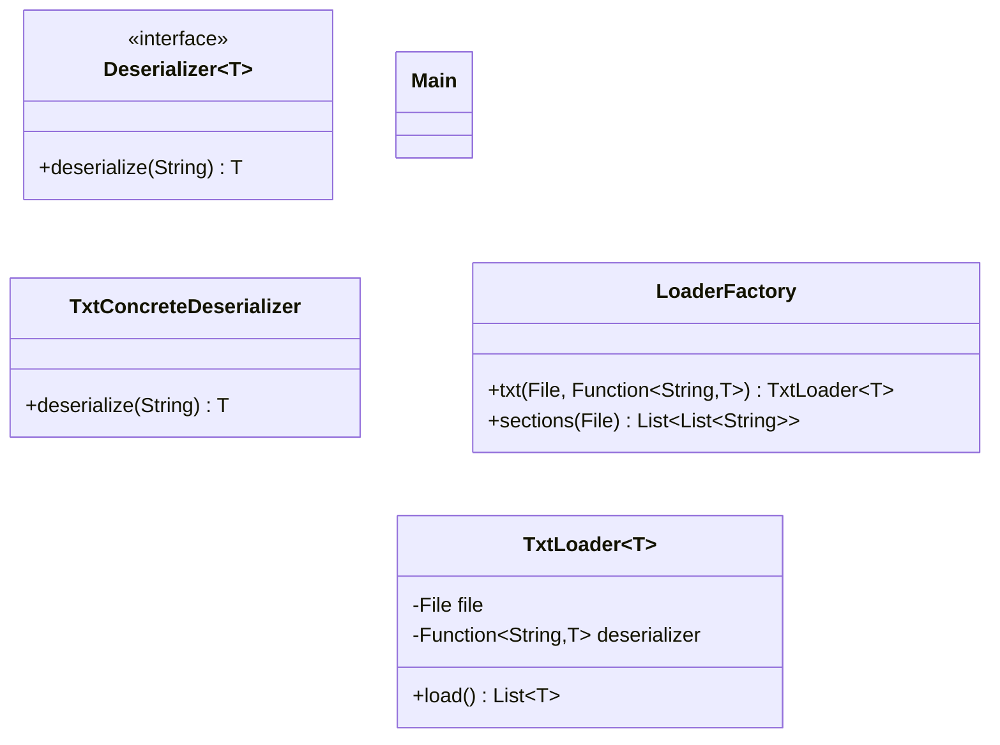

```mermaid
%%{init: { 'themeVariables': { 'lineColor': '#FFFFFF' } } }%%
classDiagram
    direction TB

    class Deserializer~T~ {
        <<interface>>
        +deserialize(String) T
    }

    class TxtConcreteDeserializer {
        +deserialize(String) T
    }

    class LoaderFactory {
        +txt(File, Function~String,T~) TxtLoader~T~
        +sections(File) List~List~String~~
    }

    class TxtLoader~T~ {
        -File file
        -Function~String,T~ deserializer
        +load() List~T~
    }

    class Main {
    }

    Deserializer <|.. TxtConcreteDeserializer 
    Main --> LoaderFactory
    Main --> TxtConcreteDeserializer
    Main ..> TxtLoader
    LoaderFactory ..> TxtLoader
```