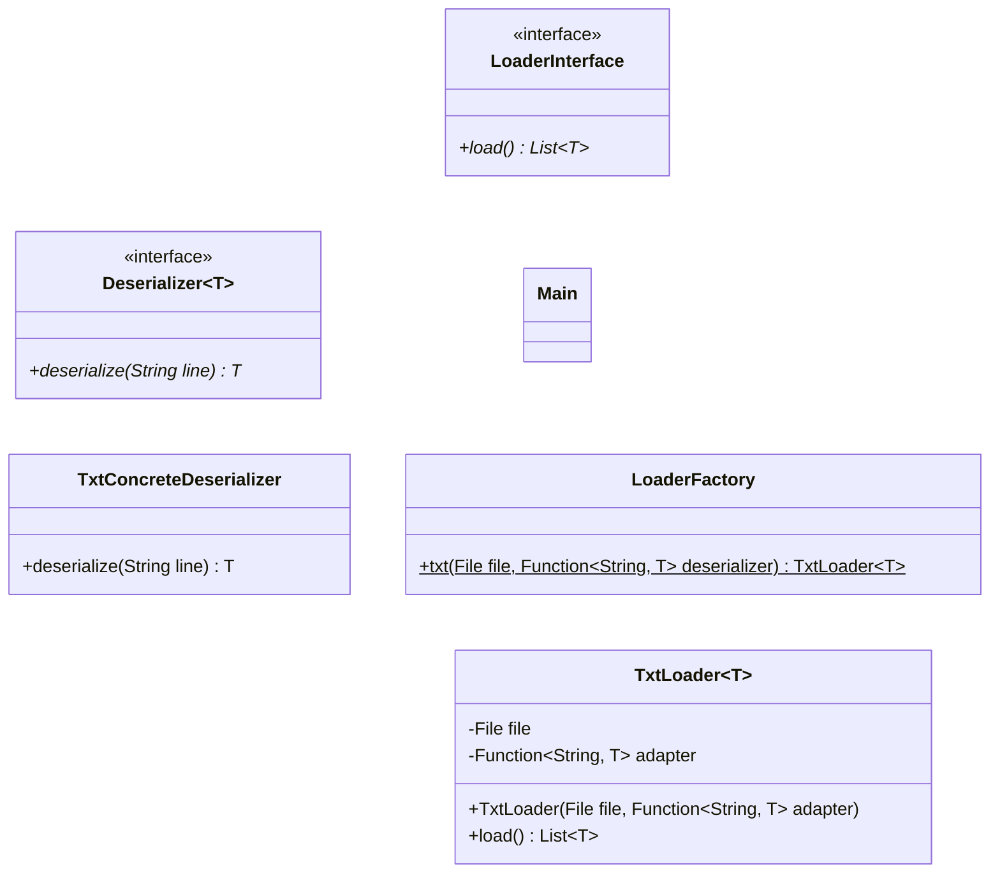

```mermaid
%%{init: { 'themeVariables': { 'lineColor': '#FFFFFF' } } }%%
classDiagram
    direction TB

    class LoaderInterface {
        <<interface>>
        +load()* List~T~
    }

    class Deserializer~T~ {
        <<interface>>
        +deserialize(String line)* T
    }

    class TxtConcreteDeserializer {
        +deserialize(String line) T
    }

    class LoaderFactory {
        +txt(File file, Function~String, T~ deserializer)$ TxtLoader~T~
    }

    class TxtLoader~T~ {
        -File file
        -Function~String, T~ adapter
        +TxtLoader(File file, Function~String, T~ adapter)
        +load() List~T~
    }

    class Main {
    }

    %% Implementaciones de Interfaces
    Deserializer <|.. TxtConcreteDeserializer 
    LoaderInterface <.. Main 
    %% Dependencias reales del Main
    Main --> LoaderFactory
    Main --> TxtConcreteDeserializer
    Main --> LoaderInterface

    %% Dependencias internas de la Infraestructura (IO)
    LoaderFactory ..> TxtLoader
```